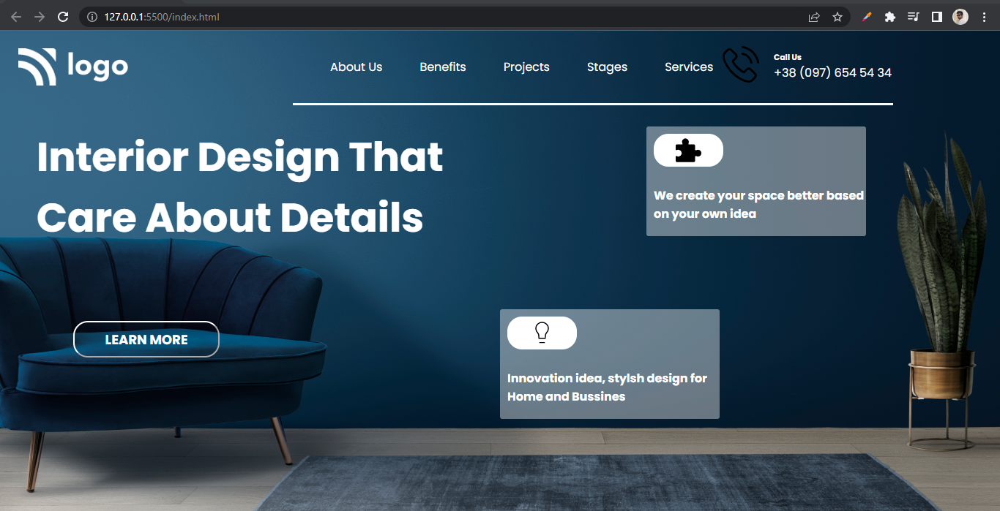

# Assignment 10

## Project 10 [Live Link](https://nachiketkeripaleproject10.netlify.app/)

- Build this project from strach n this project.
- Used gap property and border-bottom property to show underline for the menus
- Used svg files.
- Used Goolge Fonts for this project.

---

## Time taken to finish this project

-   4 hour to complete it.

#### Screenshot

 

